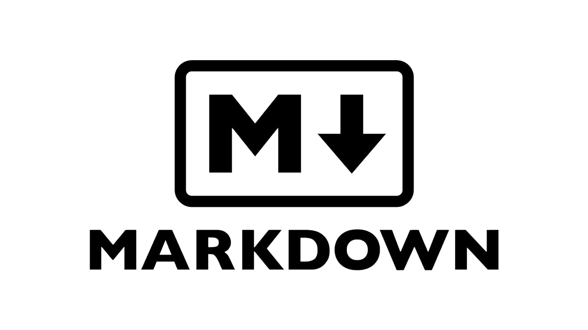

# MARDOWN

---

Что такое Markdown?

**Markdown** - простой язык разметки.
Является упрощенной версией HTML.

---
Чтобы вернуться на главную страницу нажмите [сюда](./readme.md "подсказка")

---
**Markdown** -разметка используется для написания документов, блогов, комментариев. Популярные (и не очень) мессенджеры частично поддерживают эту разметку. Большинство IDE преобразуют markdown-разметку, которую пишет разработчик в оформленный текст.

